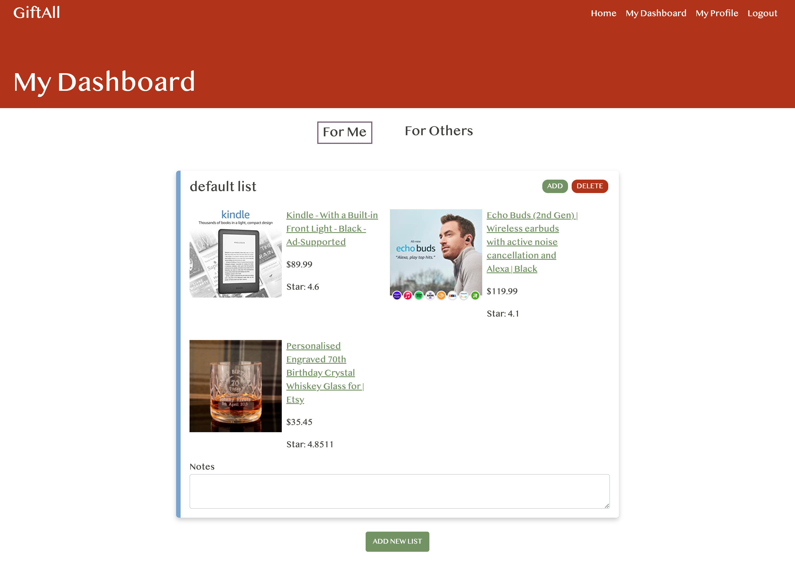

# GiftAll

Web Application that will remember and organize the gift ideas to show yourself or others some love.
<br>

<div align="left">


</div>
<br>

Check out the deployed version [here](https://giftideas.work/).

## Description

GiftAll is a mobile friendly application that will keep track of any gift ideas that you have for yourself or others. Simply make an account and login to create a list for you or for others. Once the lists are created, you can add an item by dropping in a link for Etsy or Google Shopping or a customized item!

## Getting Started & Execute

1. Clone this repository on your local device <br>`git clone https://github.com/hik010/gift-all.git`
2. Install dependencies: `npm install`
3. Create the database: `createdb gift-all-dev`
4. Create a `.env` file using the `.envExample` file and fill in credentials
5. Seed the database by running: `npm run seed`
6. Start: `npm run start-dev` & Open localhost:8090

### How To Use

<div align="center">



</div>

- Login or Make an Account.
- Go to My Dashboard to see my current lists and click the one you wish to view.
- Feel free to add/remove items from a list.

<!-- ## Help

Any advise for common problems or issues.

```
command to run if program contains helper info
``` -->

## Authors

Hyo Kim
[](https://www.linkedin.com/in/hyo-kim/)
